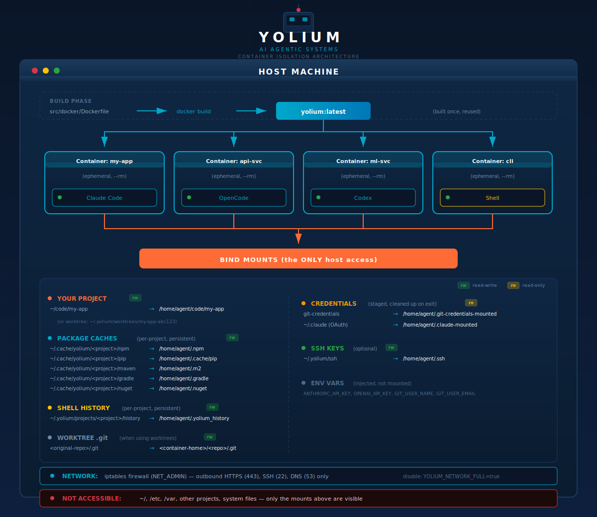

```
  ┌────────────────────────────────────────────────────┐
  │ ██╗   ██╗ ██████╗ ██╗     ██╗██╗   ██╗███╗   ███╗  │
  │ ╚██╗ ██╔╝██╔═══██╗██║     ██║██║   ██║████╗ ████║  │
  │  ╚████╔╝ ██║   ██║██║     ██║██║   ██║██╔████╔██║  │
  │   ╚██╔╝  ██║   ██║██║     ██║██║   ██║██║╚██╔╝██║  │
  │    ██║   ╚██████╔╝███████╗██║╚██████╔╝██║ ╚═╝ ██║  │
  │    ╚═╝    ╚═════╝ ╚══════╝╚═╝ ╚═════╝ ╚═╝     ╚═╝  │
  │                                                    │
  │        [■] ClaudeCode  [■] OpenCode  [■] Shell     │
  └────────────────────────────────────────────────────┘
```

**Run parallel AI agents in YOLO mode. Safely. Containerized.**

Your project is mounted in, everything else is locked out apart from persistent cache data.

### Architecture



- One image builds once → many containers spawn from it
- Containers are ephemeral (`--rm`) - deleted when session ends
- Agents can ONLY access explicitly mounted directories
- Package caches isolated per-project, agent config shared globally

## Features

### Parallel Agents with Git Worktrees

Multiple agents on one repo = file conflicts. Agent A edits `src/api.ts` while Agent B does too → race conditions, wasted tokens.

**Solution: Each agent gets its own worktree and branch.**

```
your-repo/                    # Main repository (shared .git)
/tmp/yolium-worktrees/
├── your-repo-abc123/         # Agent A: feature/auth
├── your-repo-def456/         # Agent B: fix/api-bug
└── your-repo-ghi789/         # Agent C: refactor/db
```

Each session creates a branch → provisions a worktree → mounts it in the container. Three agents work in parallel, zero conflicts, clean branches ready for PR.

### Core Capabilities

- **Multi-Tab Terminal Management** - Run multiple concurrent sessions with a tabbed interface
- **Docker Container Isolation** - Each session runs in its own Docker container, isolated from your host
- **AI Agent Selection** - Choose your preferred agent:
  - **Claude Code** - Anthropic's AI coding assistant (with optional GSD planning plugin)
  - **OpenCode** - Open-source AI coding agent
  - **Shell** - Interactive zsh terminal
- **Git Worktree Support** - Create isolated git worktrees for parallel development on different branches
- **Git Configuration** - Built-in settings for Git name, email, and GitHub PAT
- **Docker Setup Wizard** - Guided Docker installation and configuration
- **Persistent Caches** - Package manager caches (npm, pip, maven, gradle) persist across sessions (see [Persistent Cache & Host File Access](#persistent-cache--host-file-access))
- **Full Terminal Emulation** - xterm.js-based terminal with proper color support and CWD tracking
- **Full Network Restrictions**
Only outbound HTTPS and SSH
- **Cross-Platform** - Works on Windows, macOS (requires testing), and Linux

### Pre-Configured Development Profiles

Every container is a complete, reproducible development environment. No setup scripts, no missing dependencies, no "works on my machine" problems.

**Languages & Runtimes**:
- Python 3 with pip
- Java (OpenJDK) with Maven and Gradle
- Node.js with npm

**Build Tools**:
- Make, CMake, build-essential
- Maven, Gradle (with persistent caches)

**Version Control**:
- Git with full configuration
- GitHub CLI (gh) - pre-authenticated via your PAT

**Developer Utilities**:
- Editors: vim, nano
- Terminal: tmux, htop
- Search: ripgrep (rg), fd-find
- Data: jq, yq, curl, wget

**Shell**: zsh configured and ready

### Persistent Cache & Host File Access

**Important: How agents access your files**

The AI agent inside the container does **not** have direct access to your host filesystem. Yolium explicitly mounts only the directories shown in the [architecture diagram](#architecture) above.

| Host Path | Container Path | Scope | Purpose |
|-----------|----------------|-------|---------|
| Your project folder | `/home/agent/<path>` | Per-session | The codebase the agent works on |
| `~/.cache/yolium/<project>/npm` | `/home/agent/.npm` | Per-project | npm package cache |
| `~/.cache/yolium/<project>/pip` | `/home/agent/.cache/pip` | Per-project | pip package cache |
| `~/.cache/yolium/<project>/maven` | `/home/agent/.m2` | Per-project | Maven repository cache |
| `~/.cache/yolium/<project>/gradle` | `/home/agent/.gradle` | Per-project | Gradle cache |
| `~/.yolium/projects/<project>/history` | `/home/agent/.yolium_history` | Per-project | Shell command history |
| `~/.claude` | `/home/agent/.claude` | Global | Claude Code settings & memory |
| `~/.config/opencode` | `/home/agent/.config/opencode` | Global | OpenCode configuration |
| `~/.local/share/opencode` | `/home/agent/.local/share/opencode` | Global | OpenCode data |
| `~/.yolium/ssh` | `/home/agent/.ssh` | Global | SSH keys (optional) |

**This is the only way the agent interacts with your host filesystem.** The agent cannot read your home directory, other projects, or system files - only the explicitly mounted paths above.

#### Cache Retention Policy

Yolium tracks all project caches in a registry (`~/.yolium/project-registry.json`) with timestamps. Cache cleanup options:

- **Orphaned Caches**: When you delete a project folder from your system, its cache becomes "orphaned." These can be cleaned up to reclaim disk space.
- **Stale Caches**: Caches not accessed within 90 days (configurable) are considered stale and can be removed.
- **Manual Deletion**: Individual project caches can be deleted at any time.

Cache directories use readable names (e.g., `my-project-a1b2c3d4e5f6`) combining the folder name with a hash for easy identification.

This project is in early development and actively evolving. Submit issues and feedback is appreciated.

## Installation

### Prerequisites

**Docker** (platform-specific):
- **Windows**: [Docker Desktop](https://www.docker.com/products/docker-desktop/) required
- **macOS**: [Docker Desktop](https://www.docker.com/products/docker-desktop/) or [Colima](https://github.com/abiosoft/colima) (lightweight alternative) ***MacOS is currently untested***
- **Linux**: [Docker Engine](https://docs.docker.com/engine/install/) only - no Desktop needed. Just ensure the daemon is running (`sudo systemctl start docker`)

### Quick Start

1. Download the latest release for your platform
2. Install and launch Yolium Desktop
3. On first run, Yolium will guide you through Docker setup if needed
4. Configure your Git settings (name, email, optional PAT)
5. Click the **+** button to create a new session
6. Select a folder and choose your agent (Claude Code, OpenCode, or Shell)

## Development

### Tech Stack

- **Frontend**: React 19, TypeScript, Tailwind CSS 4
- **Desktop**: Electron 40 with Electron Forge
- **Terminal**: xterm.js with WebGL addon
- **Container**: Dockerode for Docker API integration
- **PTY**: node-pty for shell session management

### Building from Source

```bash
# Clone the repository
git clone https://github.com/yolium-ai/yolium.git
cd yolium

# Install dependencies
npm install

# Run in development mode
npm start

# Build for distribution
npm run make
```

### Project Structure

```
src/
├── main.ts              # Electron main process
├── App.tsx              # Main React component
├── components/          # React UI components
│   ├── TabBar.tsx       # Tab management
│   ├── Terminal.tsx     # xterm.js wrapper
│   ├── StatusBar.tsx    # Git status display
│   └── dialogs/         # Modal dialogs
├── lib/
│   ├── docker-manager.ts    # Container lifecycle
│   ├── pty-manager.ts       # Terminal sessions
│   └── git-worktree.ts      # Git integration
└── preload.ts           # Electron IPC bridge
```

## License

This project is licensed under the Yolium License Agreement. See the [LICENSE](LICENSE) file for details.

**Summary**: You may freely use Yolium locally or within your organization to build products. Reselling, hosting as a service, or commercial redistribution requires explicit permission from the core contributors.

## Acknowledgments

- [AgentBox](https://github.com/fletchgqc/agentbox) - Inspiration for containerized agent environments
- [Electron](https://www.electronjs.org/) - Cross-platform desktop framework
- [xterm.js](https://xtermjs.org/) - Terminal emulation
- [Docker](https://www.docker.com/) - Container platform
- [Claude Code](https://claude.ai/) - AI coding assistant by Anthropic
- [OpenCode](https://github.com/opencode-ai/opencode) - Open-source AI agent

## Support

For issues and feature requests, please use the GitHub issue tracker.
